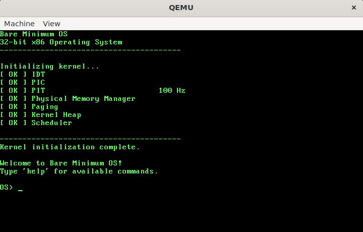
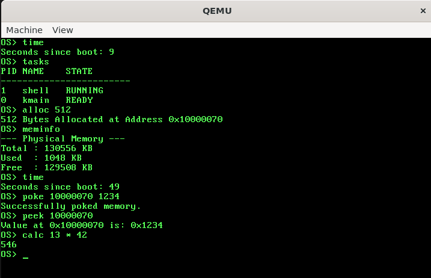
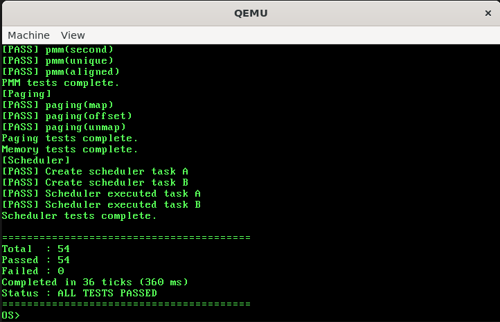

# Bare Minimum OS
A 32-bit x86 operating system written from scratch in C and x86 Assembly.

Currently, the OS runs entirely in kernel mode (Ring 0). User mode and
system calls are the next major development milestones.

## Features

### Boot & CPU
- Custom BIOS bootloader with disk loading
- 32-bit x86 protected mode
- Global Descriptor Table (GDT)
- Interrupt Descriptor Table (IDT) and interrupt service routines
- 8259 PIC remapping and hardware IRQ handling

### Memory Management
- BIOS E820 memory map detection
- Bitmap-based physical memory manager
- Next-fit physical frame allocation
- Two-level x86 paging
- Recursive page directory mapping
- Dynamic kernel heap (`kmalloc` / `kfree`)
- Heap growth, block splitting and coalescing

### Multitasking
- Preemptive scheduler
- Kernel threads
- Task control blocks
- Task states and lifecycle management
- Task sleeping and waking
- Context switching
- Task termination and cleanup

### Drivers
- VGA text-mode driver with back buffering
- PS/2 keyboard driver with circular input buffer
- Programmable Interval Timer (100 Hz)

### Kernel Utilities
- Interactive kernel shell
- Custom freestanding C library
- Kernel test suite

## Roadmap

### Userspace
- [ ] Kernel-managed GDT
- [ ] Ring 3 code/data segments
- [ ] Task State Segment (TSS)
- [ ] System call interface
- [ ] Per-process address spaces
- [ ] ELF executable loader

### Storage
- [ ] ATA driver
- [ ] Virtual File System
- [ ] FAT32

### Longer Term
- [ ] User-space shell
- [ ] UEFI boot support
- [ ] Graphics / GUI

## Screenshots / GIFs

### Boot


### Kernel Shell


### Kernel Test Suite


## Building & Running

### Requirements
- `i686-elf-gcc` cross-compiler and binutils
- NASM
- QEMU (or another x86 emulator)

See [Toolchain Setup](docs/toolchain_setup.md) for instructions on
building the cross-compiler.

This project uses a standard Makefile for building and running the OS.

```bash
make all        # Build the kernel and create boot.img
make run        # Run the OS in QEMU
make clean      # Delete build files
```

## 📂 Folder Structure

```text
osdev/
|----- build/       # Compiled binaries and final boot.img
|----- cross/       # i686-elf-gcc toolchain location
|----- docs/        # Detailed project documentation and images
|----- src/
|       |----- bootloader.asm  # Custom BIOS bootloader
|       |----- kernel_entry.asm
|       |----- kernel.c        # Kernel entry point
|       |----- apps/           # Kernel shell and test suite
|       |----- interrupts/     # IDT, ISR and PIC
|       |----- drivers/        # Keyboard, VGA and PIT drivers
|       |----- libc/           # Custom freestanding C library
|       |----- mm/             # PMM, paging and kernel heap
|       |----- task/           # Multitasking and scheduling
|
|----- linker.ld    # Linker script
|----- Makefile     # Build commands
|----- README.md    # This file
|----- LICENSE
```

## References
- [OSDev Wiki](https://wiki.osdev.org/)

This project is open-source and licensed under the terms of the `LICENSE` file.