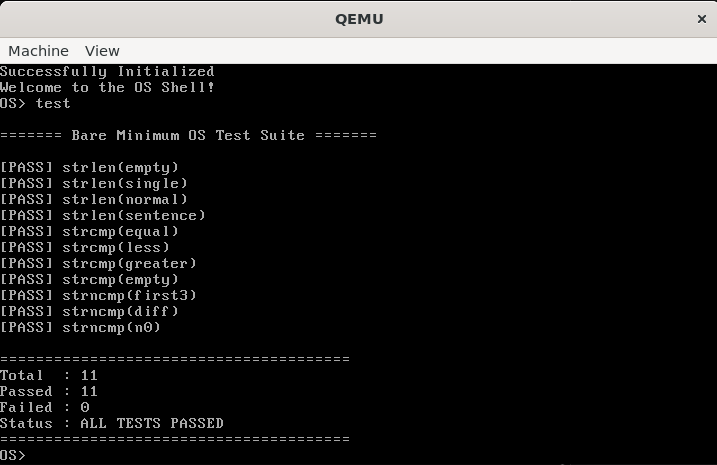

# Bare Minimum OS
A hobby 32-bit x86 operating system written entirely from scratch in C and x86 Assembly.

## ✨ Current Features

- [x] Custom BIOS Bootloader
- [x] 32-bit Protected Mode
- [x] Global Descriptor Table (GDT)
- [x] Interrupt Descriptor Table (IDT)
- [x] Interrupt Service Routines (ISR)
- [x] Hardware IRQ Handling
- [x] 8259 PIC Remapping
- [x] Programmable Interval Timer (100 Hz)
- [x] Basic Kernel Shell
- [x] PS/2 Keyboard Driver
- [x] VGA Text Mode Driver
- [x] Automated Makefile Build
- [x] Custom libc
- [x] Physical Memory Manager
- [x] Paging (Virtual Memory)
- [x] Recursive Page Directory Mapping
- [x] Kernel Heap (`kmalloc` / `kfree`)
- [x] Test Suite
- [x] Scheduler

## 🚀 Roadmap

### Core Kernel

- [ ] Kernel Threads
- [ ] Ring 3 User Mode
- [ ] TSS
- [ ] System Calls

### Storage

- [ ] ATA Driver
- [ ] FAT32
- [ ] Virtual File System

### Future

- [ ] ELF Loader
- [ ] x86-64 Support (Maybe)
- [ ] UEFI Boot
- [ ] GUI (Maybe)

## Screenshots / GIFs




## Requirements:
- binutils
- Cross Compiler (`i686-elf-gcc`)
- NASM
- linker (`ld`)
- QEMU (or other VM Software)

## 📖 Documentation and Setup:
Detailed Setup instructions and Architecture Documentation is stored in `docs/` directory.

* **[Toolchain Setup](docs/toolchain_setup.md):** Step-by-step instructions for downloading, compiling, and installing the required `i686-elf` cross-compiler. **(Start here if you are building for the first time!)**
* **[Architecture & Design](docs/architecture.md):** Details on the boot sequence, physical memory map, interrupt routing (IDT/PIC), and hardware I/O ports.

## 🚀 Usage:
This project uses a standard Makefile for easy building and testing.
```bash
make all        # Build the kernel and create boot.img
make run        # Run the OS in QEMU
make clean      # Delete Build Files
make print      # For Debugging the Makefile
```

## 📂 Folder Structure:
```
osdev/
|----- build/       # Compiled binaries and final boot.img
|----- cross/       # i686-elf-gcc toolchain location
|----- docs/        # Detailed project documentation and images
|----- src/
|       |----- bootloader.asm  # The Custom Bootloader
|       |----- kernel_entry.asm 
|       |----- kernel.c        # Custom C Kernel entry point
|       |----- apps/           # Contains apps for OS (shell, etc.)
|       |----- interrupts/     # Contains code to handle Interrupts (idt, isr, pic)
|       |----- drivers/        # Contains drivers (keyboard, vga, pit, etc.)
|       |----- libc/           # Custom C library for the OS
|       |----- mm/             # Memory Manager
|
|----- linker.ld    # Linker file to link all binaries
|----- Makefile     # Easy Build Commands
|----- README.md    # This file
|----- LICENSE
```

## References:
- [OSdev Wiki](https://wiki.osdev.org/)

This project is open-source and licensed under the terms of the `LICENSE` file.