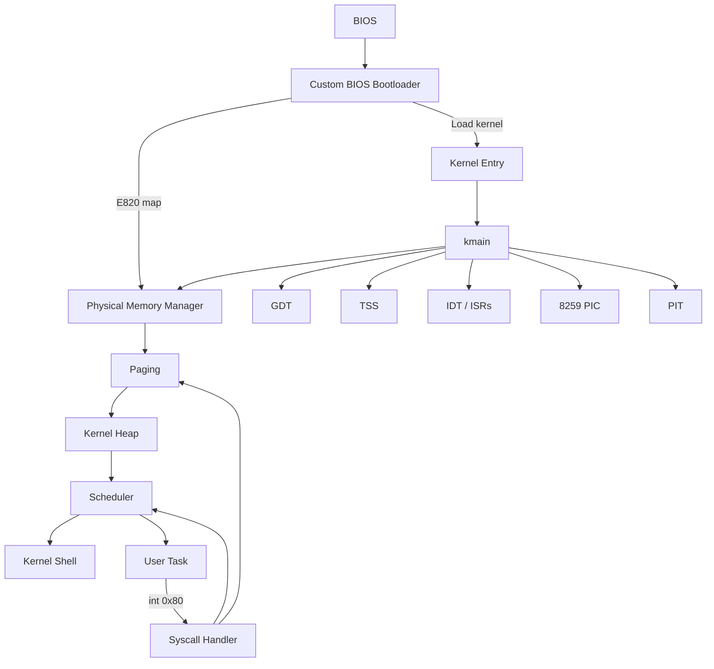
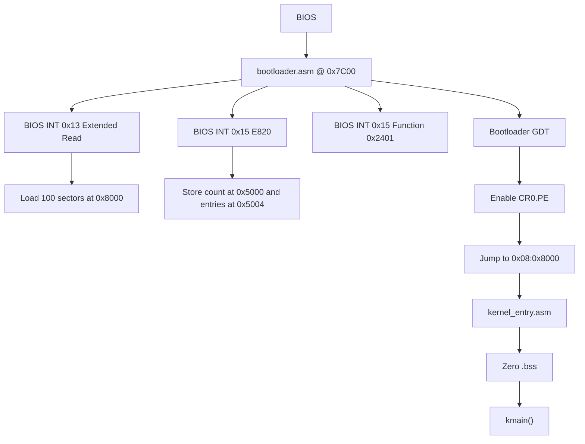
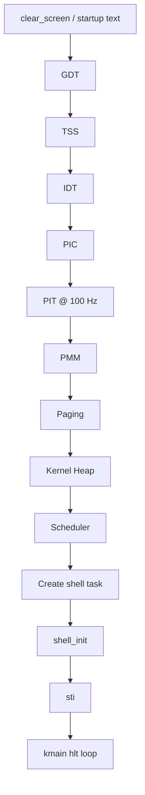
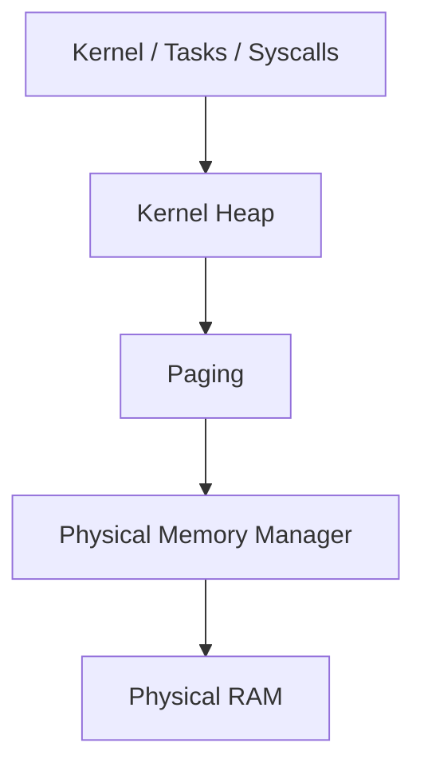

# Kernel Architecture & Design

Bare Minimum OS is a 32-bit i686 operating system with a monolithic kernel. The kernel is implemented in C and x86 Assembly.

The current system contains both Ring 0 kernel execution and a Ring 3 userspace path. The kernel creates its own GDT during initialization, installs a TSS, sets up the IDT/PIC/PIT, enables paging, starts the scheduler, and provides a small `int 0x80` syscall interface for user code.

## System Overview



## Physical Memory Map

The current boot/kernel code uses the following fixed physical addresses.

| Address | End | Purpose |
|---|---|---|
| `0x00000` | `0x003FF` | BIOS Interrupt Vector Table (IVT) |
| `0x00400` | `0x004FF` | BIOS Data Area (BDA) |
| `0x05000` | — | E820 memory-map data |
| `0x07C00` | `0x07DFF` | Bootloader code and data (512-byte boot sector) |
| `0x08000` | — | Kernel load/link address |
| `0x90000` | — | IDT storage (`256 * 8` bytes) |
| `0xA0000` | — | Initial kernel stack top |
| `0xB8000` | `0xBFFFF` | VGA text-mode memory |

The E820 entry count is stored at `0x5000`. The entries begin at `0x5004` and are stored as 24-byte records by the current bootloader.

The kernel is linked with `ENTRY(_start)` and the linker location counter begins at `0x8000`.

## Boot Process

The bootloader starts at `0x7C00` in 16-bit real mode.



The bootloader:

1. Disables interrupts and initializes real-mode segment registers and the stack.
2. Stores the BIOS boot drive number.
3. Resets the disk with BIOS `INT 0x13` function `AH=0x00`.
4. Uses BIOS `INT 0x13` function `AH=0x42` with a Disk Address Packet to read 100 sectors beginning at LBA 1 into `0x0000:0x8000`.
5. Enables A20 using BIOS `INT 0x15`, function `AX=0x2401`.
6. Collects the E820 memory map with BIOS `INT 0x15`, `EAX=0xE820`, `EDX='SMAP'`.
7. Loads the bootloader GDT.
8. Enables protected mode by setting `CR0.PE`.
9. Jumps to the kernel at `0x08:0x8000`.

`kernel_entry.asm` then clears the linker-defined `.bss` range and calls `kmain()`. If `kmain()` ever returns, the entry code disables interrupts and halts in a loop.

## GDT and TSS

The kernel creates a six-entry GDT:

| Index | Selector | Descriptor |
|---:|---:|---|
| `0` | `0x00` | Null descriptor |
| `1` | `0x08` | Kernel code |
| `2` | `0x10` | Kernel data |
| `3` | `0x1B` | User code |
| `4` | `0x23` | User data |
| `5` | `0x28` | TSS |

The kernel code/data descriptors span the full 32-bit segment range with the flags configured by `gdt_set_entry()`.

`gdt_flush.asm` loads the kernel GDT with `lgdt`, reloads the segment registers with selector `0x10`, and performs a far jump to selector `0x08`.

The TSS is zeroed during initialization. Its `ss0` is set to the kernel data selector `0x10`, and `esp0` is initialized to `0xA0000`. `tss_set_kernel_stack()` updates `esp0` when a user task is selected. The TSS descriptor is installed at GDT index 5 and `ltr 0x28` loads the task register.

## Kernel Initialization

`kmain()` initializes the current kernel in this order:



The shell is created with `create_task("shell", task_shell)` and added to the scheduler's circular task list. The kernel then enables interrupts and remains in a `hlt` loop.

## Interrupts and IRQ Routing

The IDT contains 256 entries and is stored at physical address `0x90000`.

All entries initially point to `isr_unhandled`. The kernel then installs handlers for CPU exceptions `0–31`, hardware IRQ vectors `32` and `33`, and the user-callable syscall vector `128`.

### PIC Remapping

The 8259 PIC is remapped so the hardware IRQ range does not overlap the CPU exception range.

| Source | IRQ | IDT Vector |
|---|---:|---:|
| CPU exceptions | — | `0–31` |
| Master PIC | `0–7` | `32–39` |
| Slave PIC | `8–15` | `40–47` |

Currently used hardware vectors are:

| IRQ | Vector | Device |
|---:|---:|---|
| `IRQ0` | `32` | PIT |
| `IRQ1` | `33` | PS/2 keyboard |

The remaining PIC IRQs are not assigned a device handler in the current source.

### Hardware I/O Ports

These ports are used directly by the current device drivers and interrupt code.

| Port | Purpose |
|---|---|
| `0x20` | Master PIC command / EOI |
| `0x21` | Master PIC data / interrupt mask |
| `0x40` | PIT channel 0 data |
| `0x43` | PIT command |
| `0x60` | PS/2 keyboard data |
| `0xA0` | Slave PIC command |
| `0xA1` | Slave PIC data / interrupt mask |
| `0x3D4` | VGA CRT controller index |
| `0x3D5` | VGA CRT controller data |
| `0x80` | I/O delay used during PIC initialization |
| `0x64` | Keyboard-controller command port used by the `reboot` shell command |

### Common ISR Path

The assembly stub disables interrupts, creates a uniform stack layout, saves general-purpose registers, saves the current `DS`, loads kernel data segments, and calls `isr_handler()` in C.

The C dispatcher routes:

- vector `32` → `pit_handler()`
- vector `33` → `keyboard_handler()`
- vector `128` → `syscall_handler()`
- vectors `< 32` → CPU-exception handling

For a page fault (exception `14`), the handler also reads `CR2` and prints the faulting memory address.

## PIT

`pit_init()` uses the PIT base frequency constant `1193180` and accepts a requested frequency. Frequencies below `20` Hz are clamped to `20` Hz.

The kernel calls:

```c
pit_init(100);
```

so the current kernel configuration runs at 100 Hz.

The PIT handler increments the global tick counter and runs the scheduler every 5 timer ticks. At 100 Hz, that corresponds to a nominal 50 ms scheduler interval.

## Memory Management

The memory subsystem has three main layers:



- PMM manages physical frames.
- Paging maps virtual addresses to physical frames.
- The heap provides dynamic kernel allocation on top of paging.

See [Memory Management](memory.md).

## Multitasking

The scheduler keeps tasks in a circular linked list.

PID `0` is assigned to the initial `kmain` execution context. After scheduler initialization, `kmain` remains in its halt loop and functions as the kernel's idle execution context.

Tasks can be:

- `TASK_READY`
- `TASK_RUNNING`
- `TASK_WAITING`
- `TASK_DEAD`

The scheduler is preemptive because the PIT interrupt calls `schedule()` after every fifth tick. Tasks can also voluntarily call `yield()` or enter `TASK_WAITING` with `task_sleep()`.

See [Multitasking](multitasking.md).

## Ring 3 and System Calls

The kernel GDT includes user code/data segments, and `enter_usermode` constructs an `iret` frame containing:

- user `SS = 0x23`
- user `ESP`
- EFLAGS with IF set
- user `CS = 0x1B`
- user `EIP`

The syscall IDT entry is vector `128` (`int 0x80`) and has DPL 3, allowing Ring 3 code to invoke it.

User tasks receive separate page directories through `paging_create_address_space()`. Kernel-only PDEs from the kernel directory are copied into the new directory, while user-marked PDEs are not copied. A recursive PDE is installed at entry 1023.

See [System Calls](syscall.md).

## Kernel Shell

The shell runs as a kernel task in Ring 0. It reads characters from the keyboard driver's circular buffer and implements commands for screen control, arithmetic, time, memory inspection, task inspection, kernel tests, and deliberately triggered exceptions.

The shell's available commands are defined in `src/apps/shell.c`.

## Current Limitations

The current implementation is intentionally small and is still under active development. Important current limitations include:

- Boot is BIOS-based rather than UEFI-based.
- The bootloader reads a fixed 100 sectors for the kernel image.
- The current userspace program is a raw embedded binary rather than an ELF executable.
- User task creation and memory-management behavior are still being hardened and are tracked in the bug tracker.
- The kernel shell remains a Ring 0 program even though Ring 3 execution exists for the userspace test path.
- There is no filesystem or block-device subsystem in the current source.

See the bug tracker for confirmed problems and the development roadmap for planned work.
