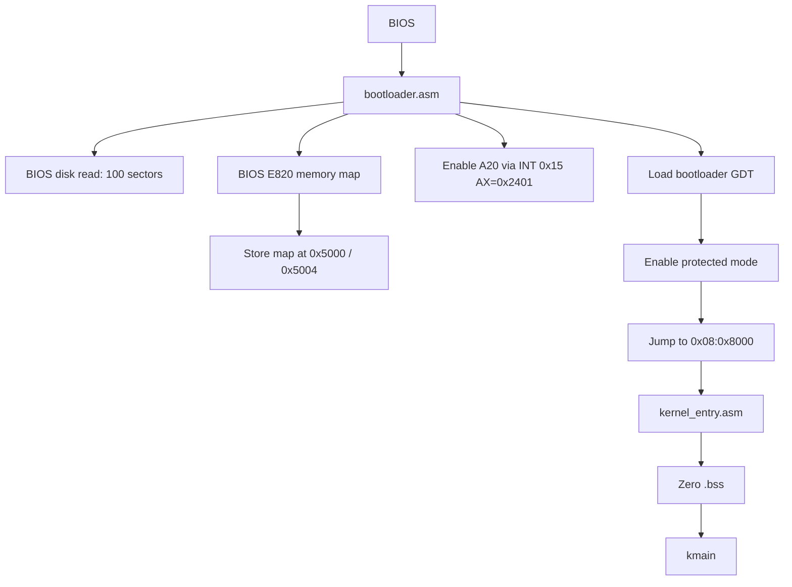
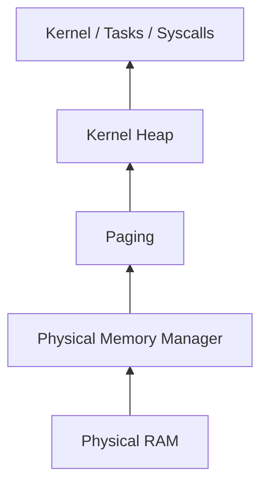
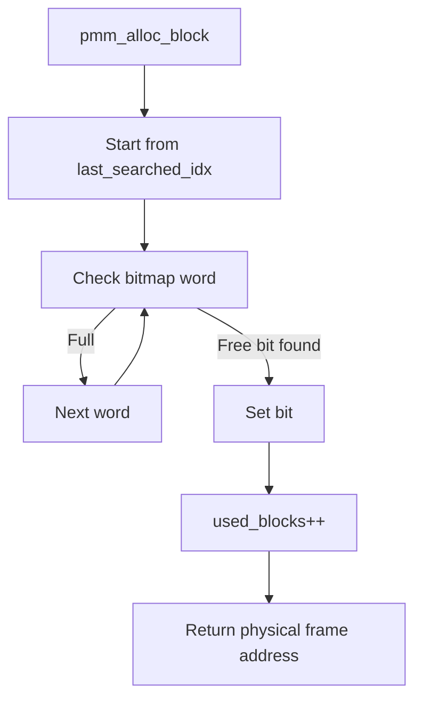
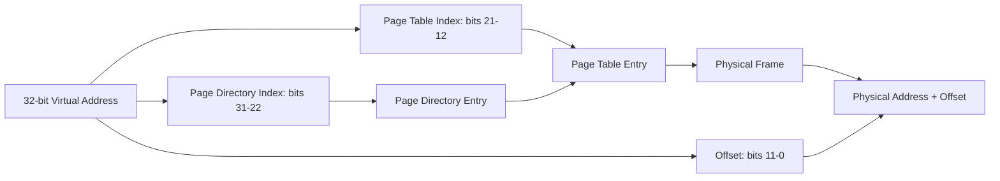
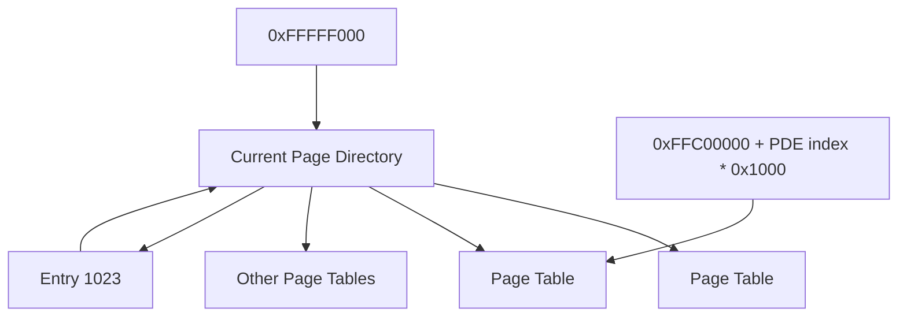
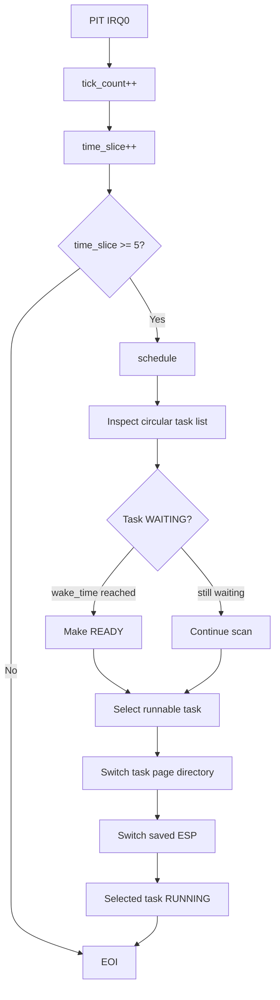
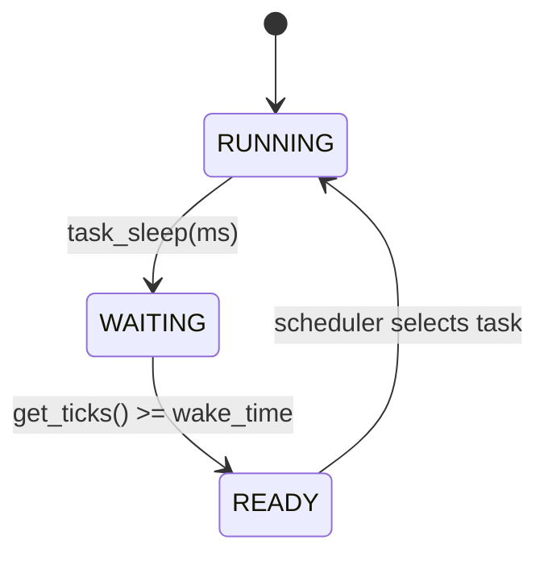
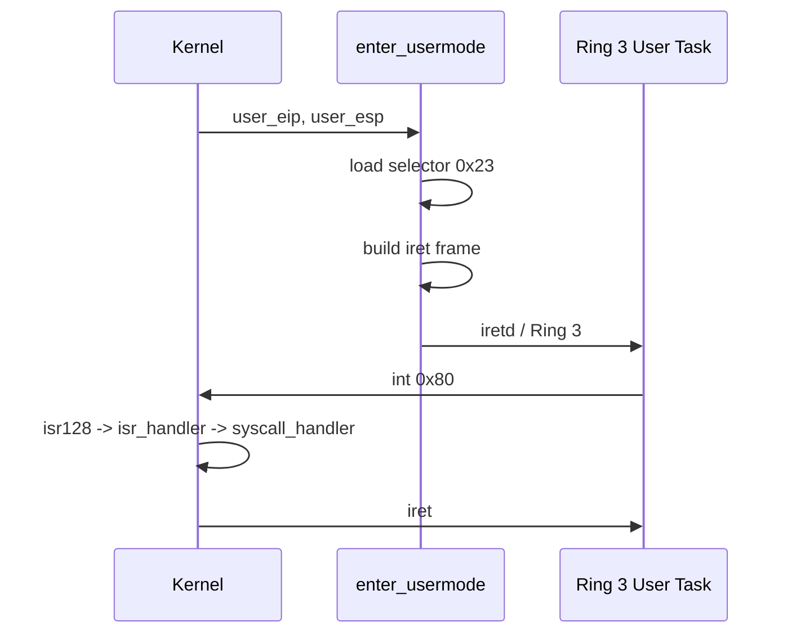
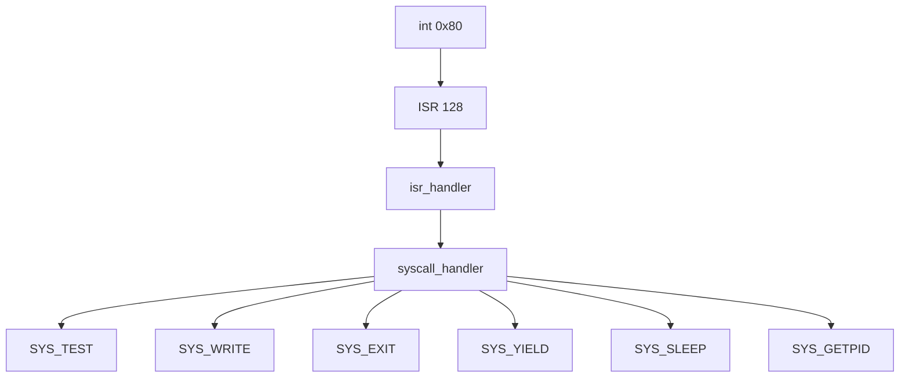

# System Diagrams

This file collects the main execution paths of the current Bare Minimum OS implementation. The diagrams use Mermaid so they can be rendered directly by GitHub and other Markdown viewers that support Mermaid.

## 1. Boot Flow



## 2. Kernel Initialization

```mermaid
flowchart TD
    K[kmain] --> GDT[gdt_init]
    GDT --> TSS[tss_init]
    TSS --> IDT[idt_init]
    IDT --> PIC[pic_init]
    PIC --> PIT[pit_init(100)]
    PIT --> PMM[pmm_init]
    PMM --> PAG[paging_init]
    PAG --> HEAP[heap_init]
    HEAP --> SCH[scheduler_init]
    SCH --> SHELL[create shell task]
    SHELL --> ST[sti]
    ST --> HLT[kmain hlt loop]
```

## 3. Memory Management Layers



## 4. Physical Frame Allocation



## 5. Virtual Address Translation



## 6. Recursive Paging



## 7. Heap Allocation

```mermaid
flowchart TD
    A[kmalloc(size)] --> B[8-byte alignment]
    B --> C{Free block fits?}
    C -->|Yes| D[Optional split]
    D --> E[Mark block used]
    E --> R[Return payload]
    C -->|No| F[Allocate required PMM frames]
    F --> G[Map pages at heap_end_vaddr]
    G --> H{Allocation succeeded?}
    H -->|No| RB[Rollback pages / frames]
    H -->|Yes| I[Create new free block]
    I --> B
```

## 8. Scheduler



## 9. Task Sleeping



## 10. Kernel/User Transition



## 11. Syscall Dispatch



## 12. User Address Validation

```mermaid
flowchart TD
    A[user_range_valid(addr, size)] --> Z{size == 0?}
    Z -->|Yes| OK[Valid]
    Z -->|No| END[Calculate end]
    END --> WRAP{32-bit wraparound?}
    WRAP -->|Yes| BAD[Invalid]
    WRAP -->|No| LIM{end <= USER_SPACE_END?}
    LIM -->|No| BAD
    LIM -->|Yes| P[Check every page]
    P --> PDE{PDE present + USER?}
    PDE -->|No| BAD
    PDE -->|Yes| PTE{PTE present + USER?}
    PTE -->|No| BAD
    PTE -->|Yes| MORE{More pages?}
    MORE -->|Yes| P
    MORE -->|No| OK
```
