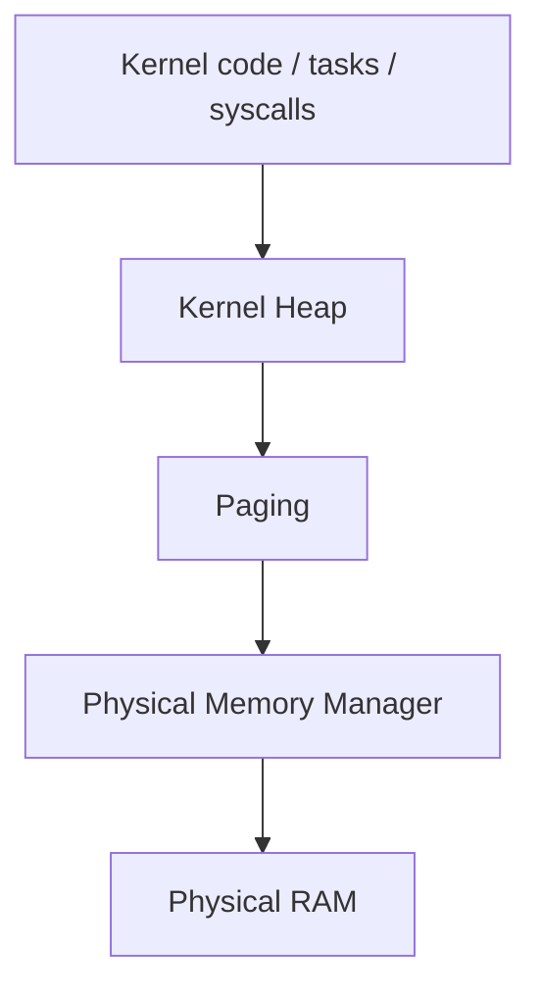
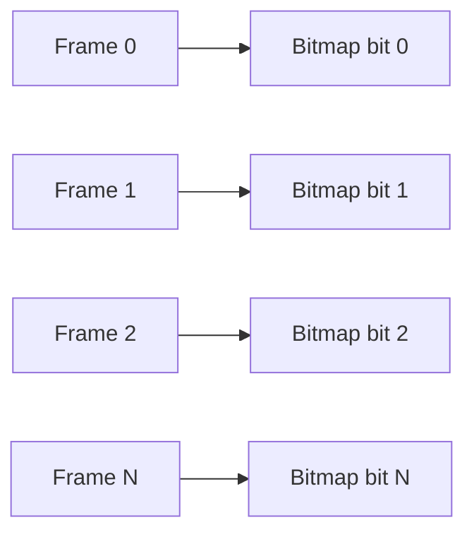
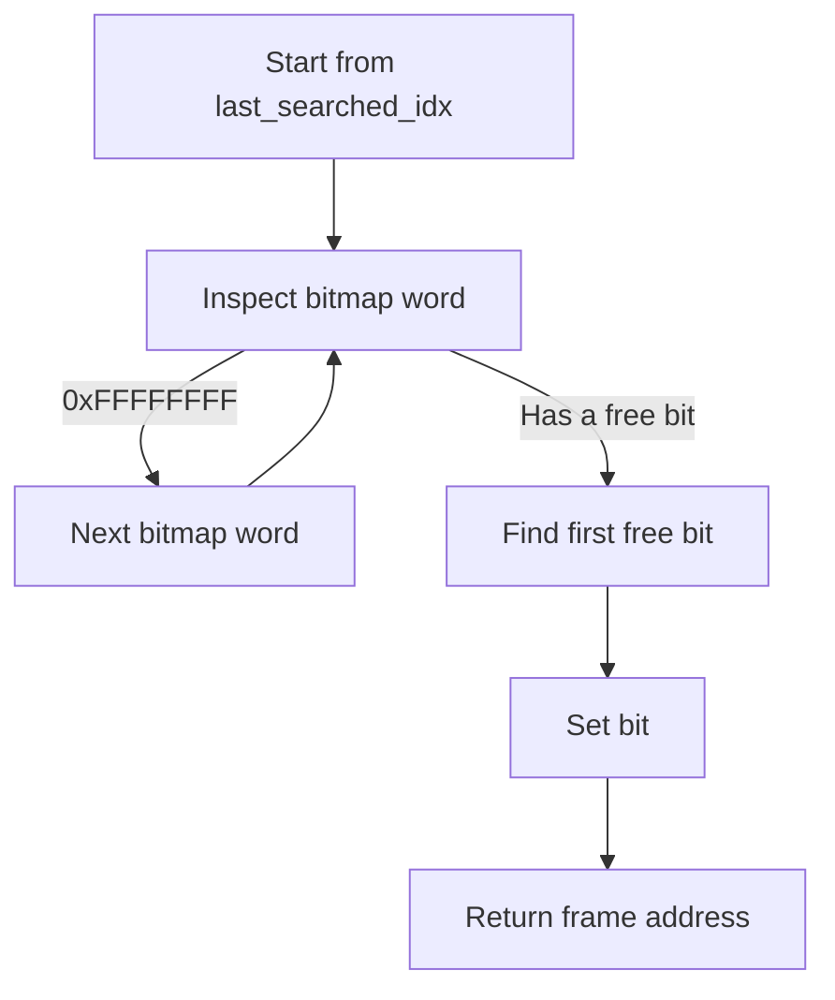
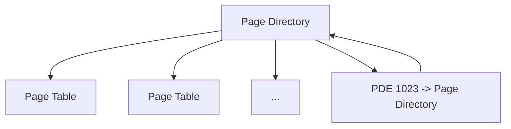
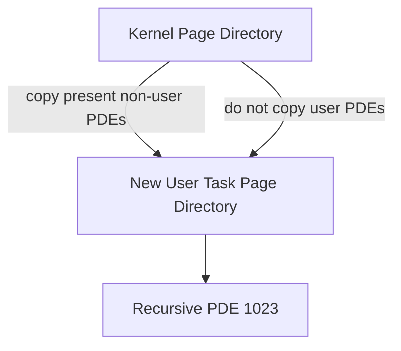
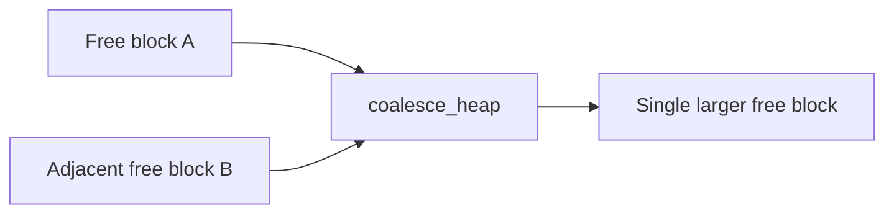

# Memory Management

Bare Minimum OS has three layers of memory management:



The current implementation uses 4 KiB pages/frames and a 32-bit x86 two-level paging structure.

## BIOS E820 Memory Map

During boot, `bootloader.asm` calls the BIOS E820 interface (`INT 0x15`, `EAX=0xE820`, `EDX='SMAP'`) and requests 24-byte entries.

The current bootloader writes:

```text
0x5000       entry count (uint32_t)
0x5004       first E820 entry
0x5004+24    second E820 entry
...
```

The E820 entry structure used by the kernel is:

```c
struct mem_map_entry {
    uint64_t base_addr;
    uint64_t region_length;
    uint32_t region_type;
    uint32_t acpi_attributes;
};
```

The PMM currently treats `region_type == 1` as usable memory.

## Physical Memory Manager

### Frame size and bitmap

The PMM is configured for the complete 32-bit physical address space:

```text
PMM_BLOCK_SIZE = 4096 bytes
PMM_MAX_BLOCKS = 1048576 frames
PMM_BITMAP_SIZE = 32768 uint32_t entries
```

`1048576 * 4096 = 4 GiB`.

Each bitmap bit corresponds to one 4 KiB physical frame:



The current bitmap convention is:

```text
1 = unavailable / allocated
0 = available
```

`pmm_init()` initially sets the entire bitmap to `0xFF`, then clears bits for complete 4 KiB frames inside usable E820 regions. The first 256 frames (the first 1 MiB) are then marked used/reserved.

### E820 range handling

For a usable E820 region, the PMM:

1. Reads the 64-bit base and length.
2. Ignores regions whose base is at or above 4 GiB.
3. Clips a region that extends past 4 GiB.
4. Rounds the beginning upward to a 4 KiB boundary.
5. Rounds the end downward to a 4 KiB boundary.
6. Clears the bitmap bits covering the complete frames.

Only complete 4 KiB frames are made available.

### Allocation strategy

`pmm_alloc_block()` uses a next-fit search. `last_searched_idx` remembers the bitmap word from the previous successful search so the next search does not always begin at word zero.

Conceptually:



A successful allocation sets the bitmap bit, increments `used_blocks`, and returns the physical address of the frame.

### Freeing

`pmm_free_block()` checks:

- the address is non-zero;
- the address is 4 KiB aligned;
- the frame index is inside the 4 GiB bitmap range;
- the frame is not in the first 1 MiB;
- the corresponding bit is currently set.

A valid free clears the bit and decrements `used_blocks`.

### Memory counters

The PMM exposes:

```c
int get_used_memory(void);
int get_total_memory(void);
```

`get_total_memory()` reports the number of complete usable frames counted from the E820 map during `pmm_init()`. It is therefore a count of usable 4 KiB frames recognized by the PMM, not a raw byte count.

## Paging

The kernel uses the 32-bit x86 two-level paging format:

```text
31                 22 21                 12 11              0
+--------------------+---------------------+------------------+
| Page Directory     | Page Table          | Offset           |
| Index (10 bits)    | Index (10 bits)     | (12 bits)        |
+--------------------+---------------------+------------------+
```

Each page is 4096 bytes. Each page directory has 1024 entries and each page table has 1024 entries.

A full page-directory/page-table hierarchy can address the entire 4 GiB 32-bit virtual address space.

### Page flags used by the kernel

```c
PTE_PRESENT = 0x01
PTE_RW      = 0x02
PTE_USER    = 0x04
```

`PTE_USER` is used to mark pages and page tables accessible from Ring 3.

### Initial kernel mapping

`paging_init()` allocates:

- one physical frame for the kernel page directory;
- one physical frame for the first page table.

The first page table identity-maps the first 4 MiB:

```text
Virtual                 Physical
0x00000000              0x00000000
        ...                     ...
0x003FFFFF              0x003FFFFF
```

The initial kernel page directory therefore has:

```text
PDE 0   -> first 4 MiB identity-mapped page table
PDE 1023 -> recursive mapping of the page directory
```

### Recursive mapping

The last page-directory entry (`1023`) points back to the current page directory itself.

The current paging code accesses the recursive structures through:

```text
0xFFFFF000  -> current page directory
0xFFC00000  -> page tables through the recursive mapping
```

This makes the page directory and page tables accessible through normal virtual addresses while paging is enabled.



### Mapping

`map_page()` calculates the PDE/PTE indexes from the virtual address. If the required page table does not exist, it allocates a physical frame for the page table, installs the PDE, and zeros the new table through the recursive address.

A user mapping cannot be placed into an existing kernel-only page table: if `PTE_USER` is requested while the existing PDE lacks `PTE_USER`, `map_page()` returns `false`.

After updating a PTE, the code executes `invlpg` for the affected virtual address.

`paging_map_page()` is the address-space-aware wrapper. It temporarily switches to the requested page directory if necessary, calls `map_page()`, and restores the previous directory.

### Unmapping

`unmap_page()` clears the PTE and invalidates the corresponding TLB entry.

If the page belongs to a user page table and removing the page leaves the table empty, the current implementation removes the PDE and returns the page-table frame to the PMM.

### Address translation

`get_physical_addr()` walks the current recursive page directory/page table mapping and returns:

```text
physical frame + page offset
```

It returns `0` when either the PDE or PTE is not present.

## Address Spaces

`paging_create_address_space()` allocates a new page-directory frame, clears it, copies present kernel-only PDEs from the kernel page directory, and installs a recursive mapping at PDE 1023.

User-marked PDEs from the kernel directory are intentionally not copied.

The resulting directory is used by a task as its `page_directory` field.



The user-space validation code currently limits the end of a user range to:

```c
#define USER_SPACE_END 0xBFFFFFFF
```

`user_range_valid()` also checks for 32-bit range wraparound and requires every page in the range to have both a present user-accessible PDE and a present user-accessible PTE.

## Address-Space Destruction

`paging_destroy_address_space()`:

1. Ignores null and the kernel page directory.
2. Switches away from the directory if it is currently active.
3. Switches into the directory being destroyed to inspect its recursive mappings.
4. Iterates through user PDEs.
5. Frees each present physical page referenced by user PTEs.
6. Frees each user page-table frame.
7. Removes the user PDEs.
8. Switches back to the kernel directory.
9. Frees the page-directory frame.

The function currently treats mapped user frames as owned by that address space; a more general shared-frame/reference-counted ownership model is planned in the development roadmap.

## Kernel Heap

The kernel heap starts at virtual address:

```c
#define HEAP_START 0x10000000
```

The first heap page is backed by a PMM frame and mapped with `PTE_PRESENT | PTE_RW`.

Heap blocks contain:

```text
magic
size
is_free
next
```

### Allocation

`kmalloc()`:

1. Rejects a zero-size request.
2. Aligns the size to 8 bytes.
3. Searches the existing heap-block list for a large enough free block.
4. Splits a sufficiently large free block when possible.
5. If no block fits, allocates enough physical pages, maps them consecutively at the current heap end, creates a new free block, and retries the allocation.

```mermaid
flowchart TD
    A[kmalloc(size)] --> B[Align size to 8 bytes]
    B --> C{Existing free block fits?}
    C -->|Yes| D[Optional split]
    D --> E[Mark used and return payload]
    C -->|No| F[Calculate required pages]
    F --> G[Allocate PMM frames]
    G --> H[Map heap pages]
    H --> I[Create new heap block]
    I --> B
```

If physical allocation or mapping fails while extending the heap, the current implementation rolls back the pages allocated during that extension attempt and returns `0`.

### Freeing and coalescing

`kfree()` uses the metadata immediately before the payload pointer. It checks the block magic value and marks the block free, after which `coalesce_heap()` combines adjacent free blocks.



## Kernel vs User Memory

The current source uses different page-table flags for kernel and user mappings:

```text
Kernel mapping:
    PTE_PRESENT | PTE_RW

User mapping:
    PTE_PRESENT | PTE_RW | PTE_USER
```

The kernel heap is mapped without `PTE_USER`. User pages are mapped through a task-specific address space and include `PTE_USER`.

## Memory Management Tests

The kernel test suite currently groups memory tests under `test_memory()` and includes tests for:

- `memset`
- `memcpy`
- heap allocation
- heap splitting/coalescing
- PMM allocation
- PMM free validation
- page mapping and address translation
- address-space creation and cleanup
- rejection of a user mapping through a kernel-only shared PDE
- page-table reclamation

These tests are launched from the kernel shell with `test memory` or as part of `test all`.
