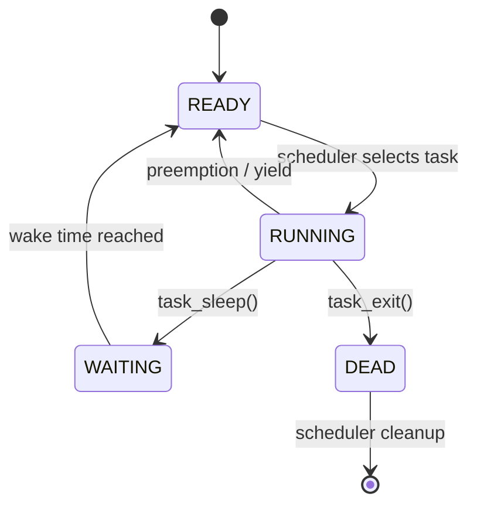
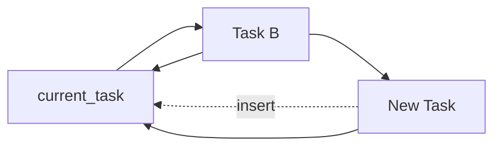
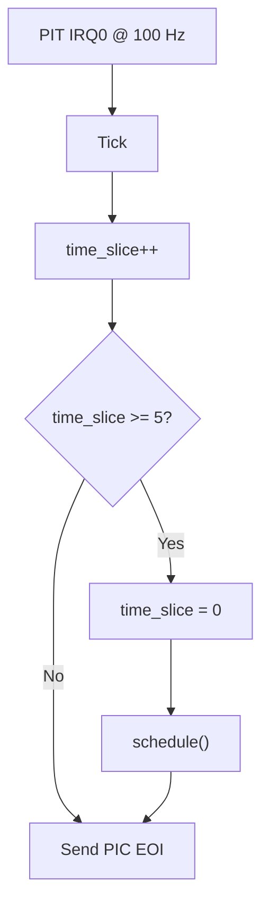
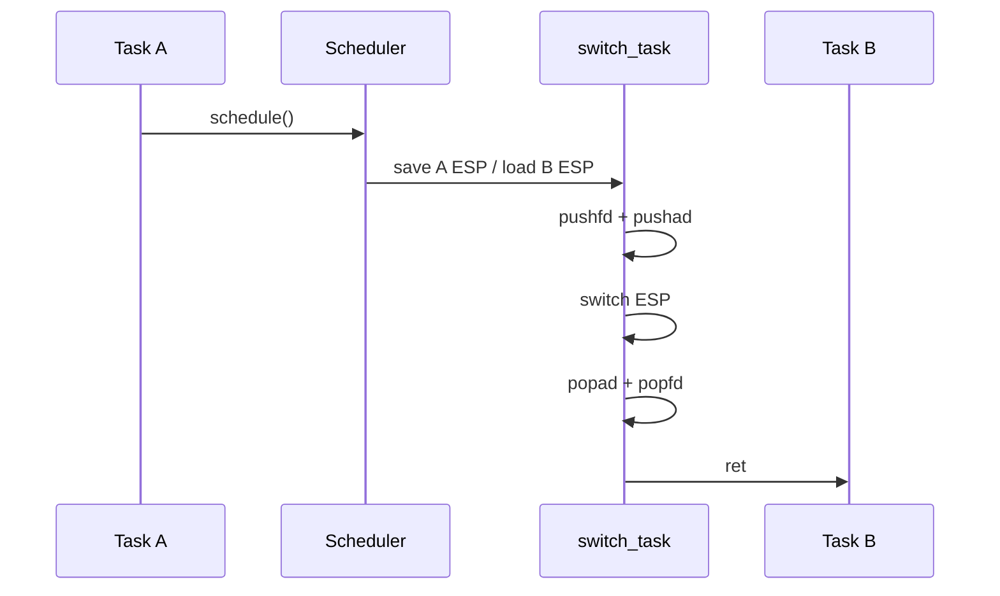
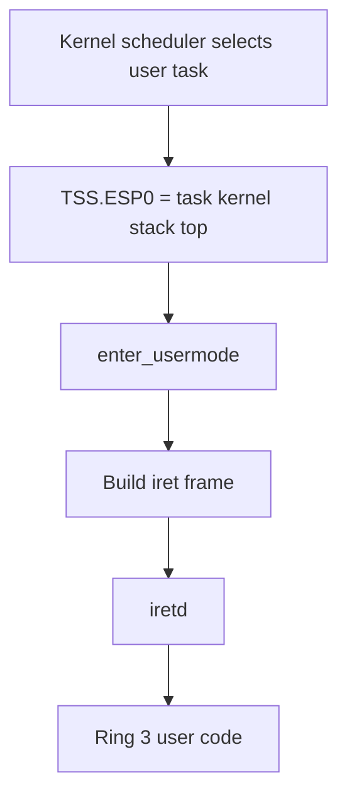

# Multitasking and Task Management

Bare Minimum OS uses a circular linked-list scheduler driven by the Programmable Interval Timer (PIT).

The current kernel supports both normal kernel tasks and a Ring 3 user-task creation path. The shell itself remains a kernel task.

## Task Control Block

Tasks are represented by `task_t`:

```text
esp
pid
name
state
stack_allocation
kernel_stack_top
page_directory
wake_time
next
```

These fields are used by the scheduler and task-creation code to preserve execution state, identify a task, manage its stack/address space, handle sleeping, and maintain the circular task list.

## Task States

The task state enum contains four states:

```c
TASK_READY
TASK_RUNNING
TASK_WAITING
TASK_DEAD
```

The normal state flow is:



`TASK_DEAD` tasks are removed from the circular task list by the scheduler and their task resources are reclaimed by the current implementation.

## Scheduler Initialization

`scheduler_init()` creates the initial task for the kernel's existing execution context.

It assigns:

```text
PID              = 0
Name             = "kmain"
State            = TASK_RUNNING
ESP              = 0
Kernel stack top = 0
Page directory   = kernel page directory
Wake time        = 0
```

The initial task's `next` pointer points back to itself, creating a circular list containing only PID 0.

After initialization, `kmain()` remains in its `hlt` loop and serves as the kernel's idle execution context.

## Adding Tasks

`task_add()` inserts a task into the circular task list. The current implementation traverses the list until it finds the node whose `next` pointer points back to `current_task`, then inserts the new task between that node and `current_task`.



The task-add path ignores a null task or an uninitialized scheduler state.

## Creating a Kernel Task

`create_task()`:

1. Allocates a `task_t` from the kernel heap.
2. Allocates a 4 KiB kernel stack from the heap.
3. Builds an initial stack frame containing:
   - a fake return address to `task_exit()`;
   - the task entry-point address;
   - EFLAGS `0x202`;
   - zeroed values for the eight registers consumed by `popad`.
4. Stores the prepared ESP in the task structure.
5. Assigns a non-zero PID using the `next_pid` counter.
6. Uses the kernel page directory.
7. Marks the task `TASK_READY`.

The shell is created this way:

```c
create_task("shell", task_shell);
```

## Scheduler Timing

The PIT is configured to 100 Hz by `kmain()`:

```c
pit_init(100);
```

Therefore one timer interrupt occurs every 10 ms in the current configuration.

The PIT handler increments `time_slice` and invokes `schedule()` after five ticks:



This gives a nominal scheduler interval of 50 ms under the current 100 Hz / 5-tick configuration.

## Scheduling

`schedule()` begins at the task after `current_task` and walks the circular list looking for a runnable task.

A waiting task is examined against the current tick count and its `wake_time`:

```text
get_ticks() >= wake_time
```

When the wake time is reached, the task becomes `TASK_READY`.

When a runnable task is selected:

1. The previous running task is changed to `TASK_READY`.
2. `current_task` changes to the selected task.
3. The selected task becomes `TASK_RUNNING`.
4. The TSS kernel stack pointer is updated for user tasks.
5. The selected task's page directory is loaded.
6. `switch_task()` performs the low-level context switch when the selected task differs from the previous one.

## Context Switching

The assembly routine `switch_task()` saves EFLAGS and all general-purpose registers on the current stack, stores the current ESP through the first argument, loads the next ESP, restores the next task's saved registers and flags, and returns.



## Voluntary Yielding

`yield()` is a direct wrapper around `schedule()`.

A task can therefore give up the CPU without waiting for its next timer preemption point.

## Sleeping

`task_sleep(milliseconds)` converts milliseconds into timer ticks using the current PIT frequency:

```c
ticks_to_wait = ((uint64_t)milliseconds * get_timer_freq() + 999) / 1000;
```

The task then sets:

```text
wake_time = get_ticks() + ticks_to_wait
state     = TASK_WAITING
```

and immediately calls `yield()` so another task can run.

```mermaid
flowchart LR
    R[RUNNING] -->|task_sleep(ms)| W[WAITING]
    W -->|PIT ticks reach wake_time| RDY[READY]
    RDY -->|scheduler selects task| R
```

The PIT tick counter itself is a `uint32_t`, and the broader wraparound behavior is tracked in the bug list.

## Task Termination

`task_exit()` marks the current task as `TASK_DEAD` and calls `yield()` immediately.

The scheduler is responsible for seeing the dead task in the circular list, unlinking it, destroying its address space, freeing its allocated stack, and freeing its task structure.

The current implementation does not expose a parent/child process relationship or a persistent exit-status mechanism.

## User Tasks

`create_user_task()` creates a task with a separate page directory and prepares a kernel stack that begins execution in `enter_usermode()`.

The initial context includes:

```text
user_esp
user_eip
fake return address -> task_exit
entry point -> enter_usermode
EFLAGS = 0x202
zeroed general registers
```

The TSS `esp0` field is set to the top of the user task's kernel stack before the task runs.

The current user test launcher separately creates:

```text
User code virtual address  = 0x00400000
User stack virtual address = 0x00800000
User stack pointer         = 0x00801000
```

and maps those pages with `PTE_USER`. The userspace image is copied from the embedded assembly symbols into one physical page.

## User-Mode Entry

`enter_usermode(user_eip, user_esp)`:

1. Disables interrupts during the transition.
2. Loads user data selector `0x23` into `DS`, `ES`, `FS`, and `GS`.
3. Builds an `iret` frame:
   - `SS = 0x23`
   - `ESP = user_esp`
   - EFLAGS with IF set
   - `CS = 0x1B`
   - `EIP = user_eip`
4. Executes `iretd`.



## User Task Address Spaces

Each user task receives a page directory from `paging_create_address_space()`.

The new directory copies present kernel-only PDEs from the kernel directory but does not copy PDEs marked with `PTE_USER`.

Before running a task, the scheduler loads its directory into `CR3`.

This gives user tasks separate user mappings while retaining the kernel mappings that the current paging implementation shares between address spaces.

## Shell Integration

The shell is a scheduled kernel task. It repeatedly asks the keyboard driver for a character. When no character is available it executes `hlt`; when a character is available it passes it to `shell_input()`.

The shell's `tasks` command calls `print_tasks()` and displays PID, name, and task state for the current circular task list.

## Scheduler Tests

The current kernel test suite includes `test_scheduler()`.

It:

1. Creates `test_a` and `test_b` kernel tasks.
2. Each task increments its own counter five times.
3. Task A sleeps for 20 ms between increments.
4. Task B sleeps for 30 ms between increments.
5. The test task sleeps for 250 ms to let both tasks run.
6. The test verifies both counters reached five.

The test is part of `test all` and can also be run through `test scheduler`.

## Current Limitations

The current scheduler/task model is still under development. In particular:

- The task model currently combines scheduling state, kernel-stack information, and address-space ownership in a single `task_t` structure.
- The PID counter is a simple incrementing `uint32_t`.
- The current scheduler cleanup path and all-waiting behavior are still being hardened.
- User-program loading is currently tied to the raw `user_test` image rather than a general executable loader.
- Exit status is present in the syscall ABI but is not retained by the current task model.

See the bug tracker and development roadmap for the current work plan.
