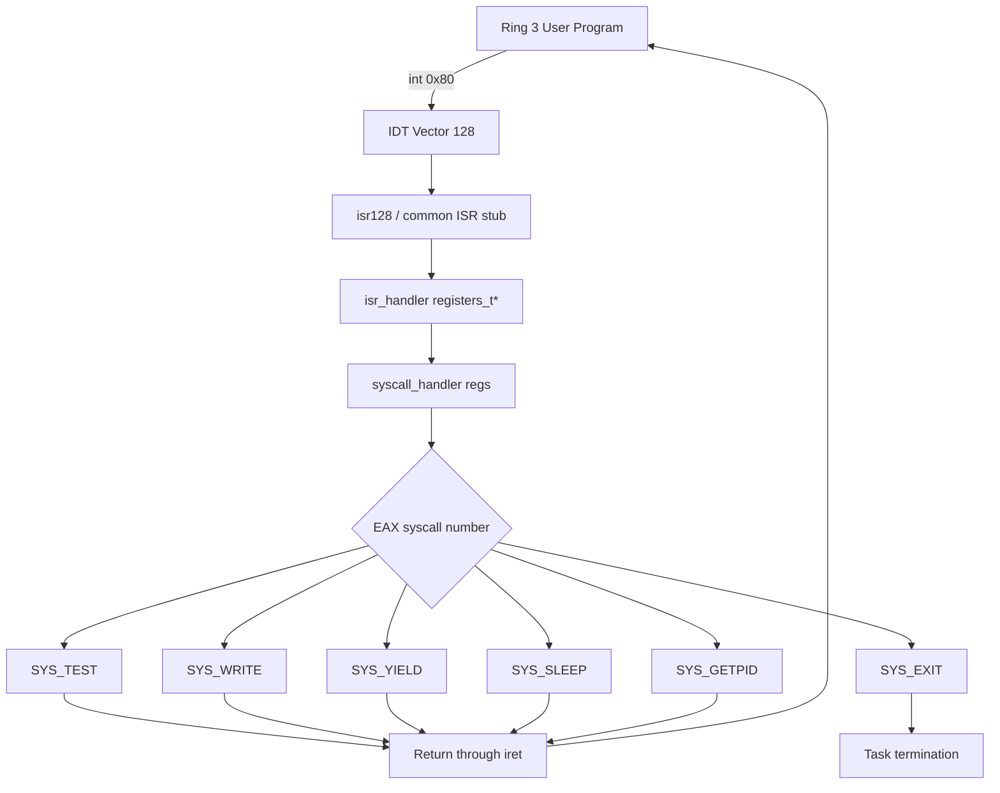
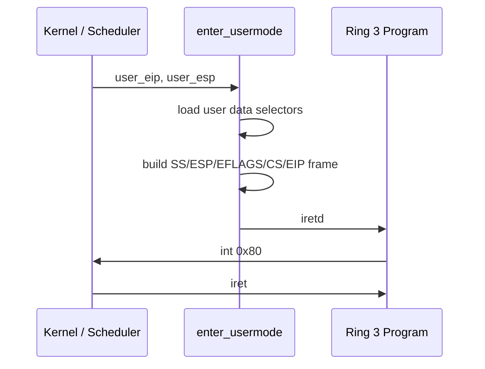

# System Calls

Bare Minimum OS provides a small system-call interface between Ring 3 user code and the kernel.

A user program invokes a system call with:

```asm
int 0x80
```

The IDT maps vector `128` to `isr128`, which enters the common ISR path and eventually calls `syscall_handler()` in C.

## Syscall ABI

The current syscall handler uses the following registers:

| Register | Meaning |
|---|---|
| `EAX` | Syscall number on entry; return value on exit |
| `EBX` | First syscall argument |
| `ECX` | Second syscall argument |
| `EDX` | Third syscall argument / general-purpose register |
| `ESI` | General-purpose register |
| `EDI` | General-purpose register |

Invocation pattern:

```asm
mov eax, <syscall_number>
; set EBX/ECX/EDX as required
int 0x80
```

The current syscall implementation writes the return value into `regs->eax`.

Negative error values are represented as 32-bit two's-complement values. For example:

```text
-1 = 0xFFFFFFFF
```

## Syscall Table

| Number | Name | Arguments | Return value |
|---:|---|---|---|
| `0` | `SYS_TEST` | none | `42` |
| `1` | `SYS_WRITE` | `EBX = buffer`, `ECX = length` | bytes written, or `-1` |
| `2` | `SYS_EXIT` | `EBX = exit status`* | does not return |
| `3` | `SYS_YIELD` | none | `0` |
| `4` | `SYS_SLEEP` | `EBX = milliseconds` | `0` |
| `5` | `SYS_GETPID` | none | current PID |

`SYS_EXIT` reserves `EBX` for an exit status, but the current kernel ignores that value.

Unknown syscall numbers return `-1`.

## `SYS_TEST` — 0

A basic syscall-path sanity check.

### Usage

```asm
mov eax, SYS_TEST
int 0x80
```

### Return value

```text
EAX = 42
```

## `SYS_WRITE` — 1

Writes bytes from a Ring 3 buffer to the kernel console using `putchar()`.

### Arguments

```text
EBX = user buffer address
ECX = number of bytes
```

### Usage

```asm
mov eax, SYS_WRITE
mov ebx, buffer
mov ecx, buffer_length
int 0x80
```

### Return value

On success:

```text
EAX = number of bytes written
```

If the buffer is null or fails the user-range validation, the syscall returns:

```text
EAX = -1
```

### User pointer validation

Before reading the supplied buffer, `sys_write()` calls:

```c
user_range_valid((uint32_t)buffer, length)
```

The validator:

1. Accepts a zero-length range.
2. Detects 32-bit virtual-address wraparound.
3. Requires the final address to be at or below `USER_SPACE_END`.
4. Walks every page touched by the range.
5. Requires each PDE to be present and `PTE_USER`.
6. Requires each PTE to be present and `PTE_USER`.

The current `USER_SPACE_END` value is:

```c
0xBFFFFFFF
```

## `SYS_EXIT` — 2

Terminates the current task by calling `task_exit()`.

### ABI

```text
EBX = exit status
```

The current kernel does not preserve or otherwise use this value.

### Usage

```asm
xor ebx, ebx
mov eax, SYS_EXIT
int 0x80
```

The syscall is expected not to return to user code.

## `SYS_YIELD` — 3

Voluntarily invokes the scheduler.

### Usage

```asm
mov eax, SYS_YIELD
int 0x80
```

### Return value

```text
EAX = 0
```

## `SYS_SLEEP` — 4

Blocks the current task for a duration in milliseconds.

### Arguments

```text
EBX = milliseconds
```

### Usage

```asm
mov eax, SYS_SLEEP
mov ebx, 2000
int 0x80
```

The current task enters `TASK_WAITING` and `task_sleep()` calculates its wake time using the configured PIT frequency.

### Return value

```text
EAX = 0
```

## `SYS_GETPID` — 5

Returns the current task PID.

### Usage

```asm
mov eax, SYS_GETPID
int 0x80
```

### Return value

```text
EAX = current_task->pid
```

PID `0` belongs to the initial `kmain` task. User tasks are assigned non-zero PIDs by the current task-creation code.

## IDT and ISR Path

The syscall path is:



The common ISR stub saves the general-purpose register set and current data segment value before entering the C dispatcher. It loads the kernel data selector `0x10` while executing the C handler and restores the saved segment value before returning.

## Ring 3 Transition

The kernel GDT defines:

```text
Kernel code selector = 0x08
Kernel data selector = 0x10
User code selector   = 0x1B
User data selector   = 0x23
TSS selector         = 0x28
```

`enter_usermode()` uses user data selector `0x23`, user code selector `0x1B`, and an `iretd` frame to enter Ring 3.



## Per-Task Address Spaces

A user task receives a page directory from `paging_create_address_space()`.

The current implementation copies present kernel-only PDEs from `kernel_page_directory`, skips PDEs marked with `PTE_USER`, and sets PDE 1023 to recursively map the new directory.

The scheduler calls `paging_switch_directory()` before restoring the selected task's execution context.

For a Ring 3 → Ring 0 interrupt, the CPU uses the task's TSS `esp0` value as the kernel stack. The scheduler updates `esp0` from the selected task's `kernel_stack_top`.

## Current Userspace Test Program

The current userspace regression program is:

```text
src/apps/user_test.asm
```

It is assembled as a raw binary and copied by `launch_user_test()`.

The current launcher uses:

```text
User code virtual address = 0x00400000
User stack virtual address = 0x00800000
User stack pointer = 0x00801000
```

The raw program uses the following syscall sequence:

```text
SYS_TEST
SYS_GETPID
SYS_WRITE (valid buffer)
SYS_WRITE (invalid pointer)
SYS_YIELD
SYS_SLEEP
SYS_EXIT
```

The invalid-pointer test deliberately passes:

```text
0xDEADBEEF
```

A successful program prints:

```text
================================
    ALL SYSCALL TESTS PASSED
================================
```

before invoking `SYS_EXIT`.

### Raw binary address calculation

Because the test is not an ELF executable, it cannot rely on ELF relocation. `user_test.asm` contains a `LOAD_ADDRESS` macro that calculates runtime addresses relative to the `0x00400000` load location.

## Current Limitations

The current syscall interface is intentionally small:

- `SYS_WRITE` writes directly to the kernel console; there are no file descriptors.
- `SYS_EXIT` accepts an exit-status argument in the ABI but the current kernel ignores it.
- There is no userspace C library or generic syscall-wrapper layer; the regression program invokes `int 0x80` directly.
- The userspace executable is currently a raw embedded binary, not an ELF-loaded program.
- User memory management, task lifetime, and address-space reclamation are still being hardened.
