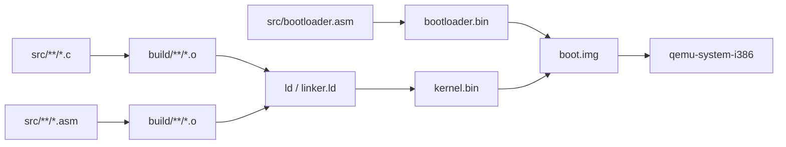

# Toolchain Setup (i686-elf-gcc)

Bare Minimum OS is built for the `i686-elf` target rather than the host operating system's native compiler target.

The repository's existing cross-toolchain layout is:

```text
cross/
└── bin/
    ├── i686-elf-gcc
    ├── i686-elf-ld
    ├── i686-elf-objcopy
    ├── i686-elf-objdump
    └── ...
```

The current build instructions use GNU binutils 2.41 and GCC 13.2.0.

## 1. Install prerequisites

On a Debian/Ubuntu-style system:

```bash
sudo apt update
sudo apt install build-essential bison flex libgmp3-dev libmpc-dev libmpfr-dev texinfo wget git nasm qemu-system-x86
```

These packages provide the build tools, GNU build dependencies, NASM, and QEMU used by the project.

## 2. Download the toolchain sources

The current setup instructions use:

- GNU binutils `2.41`
- GCC `13.2.0`

```bash
wget https://ftp.gnu.org/gnu/binutils/binutils-2.41.tar.gz
wget https://ftp.gnu.org/gnu/gcc/gcc-13.2.0/gcc-13.2.0.tar.gz
```

## 3. Extract the sources

```bash
tar -xvf binutils-2.41.tar.gz
tar -xvf gcc-13.2.0.tar.gz
mkdir build-binutils
mkdir build-gcc
```

## 4. Build binutils

The cross-toolchain is installed under the repository's `cross/` directory in the current setup.

For a repository located at `~/osdev`:

```bash
cd ~/osdev/build-binutils
../binutils-2.41/configure \
  --target=i686-elf --prefix="$HOME/osdev/cross" \
  --disable-nls --disable-werror
make -j$(nproc)
make install
```

## 5. Build GCC

The current GCC configuration enables only the C language and does not use system headers.

```bash
cd ~/osdev/build-gcc
../gcc-13.2.0/configure \
  --target=i686-elf --prefix="$HOME/osdev/cross" \
  --disable-nls --enable-languages=c --without-headers
make all-gcc -j$(nproc)
make all-target-libgcc -j$(nproc)

make install-gcc
make install-target-libgcc
```

## 6. Add the cross-compiler to PATH

The existing setup instructions use:

```bash
echo 'export PATH="$HOME/osdev/cross/bin:$PATH"' >> ~/.bashrc
source ~/.bashrc
```

You can then verify the compiler is available with:

```bash
i686-elf-gcc --version
```

The repository's Makefile also uses the local toolchain directly from:

```text
./cross/bin/
```

so adding it to `PATH` is convenient for interactive use but is not required by the existing Makefile path definitions.

## 7. Other required tools

The project also uses:

```text
nasm
qemu-system-i386
make
```

NASM assembles the bootloader and kernel assembly files. QEMU runs the generated raw boot image.

## 8. Build flow

The current project build is:



The linker script uses:

```text
ENTRY(_start)
. = 0x8000
```

and emits the kernel as a raw binary.

---